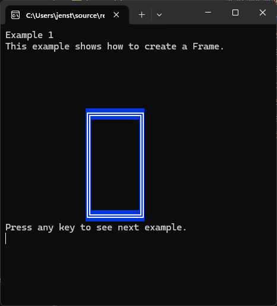
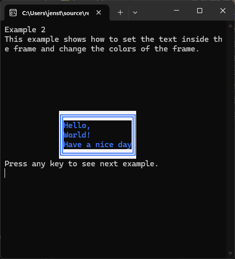
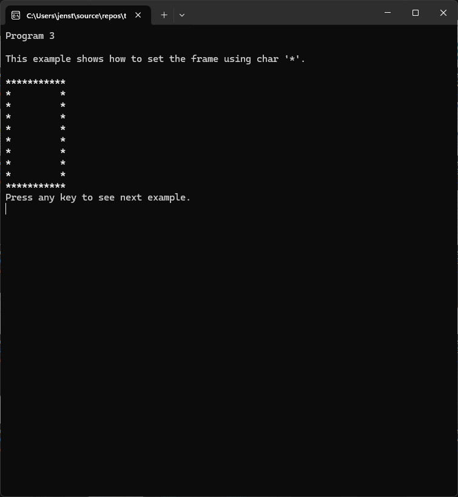

[![NuGet Downloads][nuget-shield]][nuget-url]
[![Contributors][contributors-shield]][contributors-url]
[![Forks][forks-shield]][forks-url]
[![Stargazers][stars-shield]][stars-url]
[![Issues][issues-shield]][issues-url]
[![MIT License][license-shield]][license-url]
[![LinkedIn][linkedin-shield]][linkedin-url]

<br />
<div align="center">
    <a href="https://github.com/TirsvadCLI/CSharp.Tool.Frame">
        
    </a>
    <h3 align="center">Frame handler</h3>
    <p align="center">
        <p>Frame tool for C# console applications.</p>
        <!-- PROJECT SCREENSHOTS -->
        <a href="https://github.com/TirsvadCLI/Dotnet.Tool.Frame/blob/master/images/Screenshot1.png">
            
        </a>
        <a href="https://github.com/TirsvadCLI/Dotnet.Tool.Frame/blob/master/images/Screenshot2.png">
            
        </a>
        <a href="https://github.com/TirsvadCLI/Dotnet.Tool.Frame/blob/master/images/Screenshot3.png">
            
        </a>
        <p><a href="https://github.com/TirsvadCLI/CSharp.Tool.Frame"><strong>Explore the docs</strong></a></p>
        <a href="https://github.com/TirsvadCLI/CSharp.Tool.Frame/issues/new?labels=bug&template=bug-report---.md">Report Bug</a>
        ·
        <a href="https://github.com/TirsvadCLI/CSharp.Tool.Frame/issues/new?labels=enhancement&template=feature-request---.md">Request Feature</a>
    </p>
</div>

# Frame handler
Frame tool for C# console applications.
****
## Table of Contents
- [About The Project](#about-the-project)
- [How to get started](#how-to-get-started)
  - [Installation](#installation)
- [Example](#example)
- [Contributing](#contributing)
- [License](#license)
- [Contact](#contact)

## About The Project

Frame tool for C# console applications. Create a frame with text inside. Frame can be centered to windows.

Frame can be filled with a character and colored.

## How to get started

Nuget package: https://www.nuget.org/packages/TirsvadCLI.Frame/

### Installation

```sh
dotnet add package TirsvadCLI.Frame
```

## Example

In the [example](https://github.com/TirsvadCLI/Dotnet.Tool.Frame/blob/main/src/Example/Example.cs) you can see how to use the AnsiCode class.

## Contributing

Contributions are what make the open-source community such an amazing place to learn, inspire, and create. Any contributions you make are **greatly appreciated**.

1. Fork the Project
2. Create your Feature Branch (`git checkout -b feature/AmazingFeature`)
3. Commit your Changes (`git commit -m 'Add some AmazingFeature'`)
4. Push to the Branch (`git push origin feature/AmazingFeature`)
5. Open a Pull Request

## License

Distributed under the GPL-3.0 [License][license-url].

## Contact

Jens Tirsvad Nielsen - [LinkedIn][linkedin-url]

<!-- MARKDOWN LINKS & IMAGES -->
[contributors-shield]: https://img.shields.io/github/contributors/TirsvadCLI/CSharp.Tool.Frame?style=for-the-badge
[contributors-url]: https://github.com/TirsvadCLI/CSharp.Tool.Frame/graphs/contributors
[forks-shield]: https://img.shields.io/github/forks/TirsvadCLI/CSharp.Tool.Frame?style=for-the-badge
[forks-url]: https://github.com/TirsvadCLI/CSharp.Tool.Frame/network/members
[stars-shield]: https://img.shields.io/github/stars/TirsvadCLI/CSharp.Tool.Frame?style=for-the-badge
[stars-url]: https://github.com/TirsvadCLI/CSharp.Tool.Frame/stargazers
[issues-shield]: https://img.shields.io/github/issues/TirsvadCLI/CSharp.Tool.Frame?style=for-the-badge
[issues-url]: https://github.com/TirsvadCLI/CSharp.Tool.Frame/issues
[license-shield]: https://img.shields.io/github/license/TirsvadCLI/CSharp.Tool.Frame?style=for-the-badge
[license-url]: https://github.com/TirsvadCLI/CSharp.Tool.Frame/blob/master/LICENSE
[linkedin-shield]: https://img.shields.io/badge/-LinkedIn-black.svg?style=for-the-badge&logo=linkedin&colorB=555
[linkedin-url]: https://www.linkedin.com/in/jens-tirsvad-nielsen-13b795b9/
[nuget-shield]: https://img.shields.io/nuget/dt/TirsvadCLI.Frame?style=for-the-badge
[nuget-url]: https://www.nuget.org/packages/TirsvadCLI.Frame/


